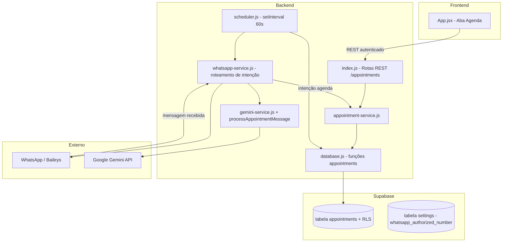
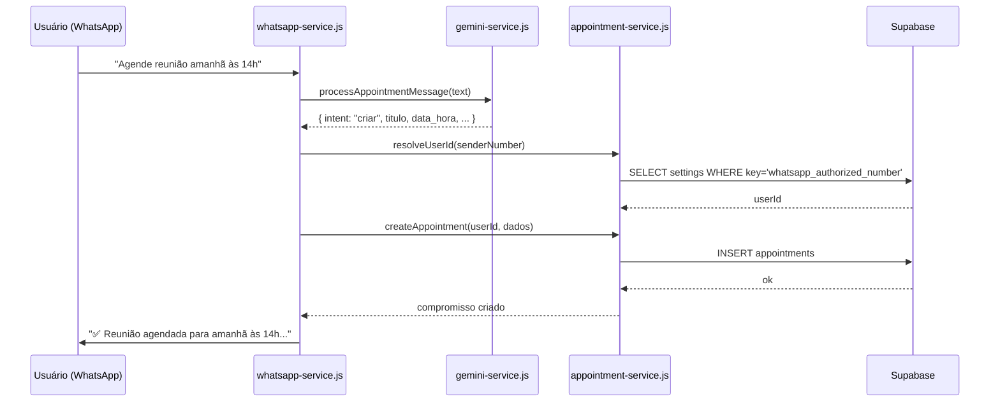
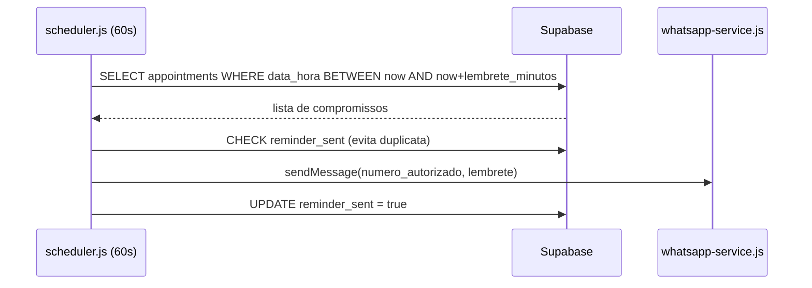

# Design Document — Agente Secretaria

## Overview

O Agente Secretaria é um módulo que estende a plataforma Finanças Pro com gerenciamento de compromissos pessoais. O usuário pode criar, consultar, editar e cancelar compromissos via mensagens de texto natural no WhatsApp (interpretadas pelo Google Gemini) ou pela interface web. O sistema dispara lembretes automáticos via WhatsApp antes dos compromissos e suporta recorrência semanal e mensal.

A funcionalidade se integra ao stack existente sem substituir nenhum componente:
- Reutiliza `authMiddleware.js` (JWT multi-tenant) para os endpoints REST
- Reutiliza `whatsapp-service.js` (Baileys) adicionando roteamento de intenção de agenda
- Reutiliza `gemini-service.js` adicionando `processAppointmentMessage`
- Reutiliza o padrão de RLS do Supabase já aplicado nas tabelas existentes
- Adiciona uma nova aba "Agenda" no `App.jsx` seguindo o padrão de abas existente

---

## Architecture



### Fluxo de Mensagem WhatsApp



### Fluxo do Scheduler



---

## Components and Interfaces

### 1. `server/appointment-service.js` (novo)

Responsável por toda a lógica de negócio de compromissos. Isola as operações de banco de dados do roteamento HTTP e do WhatsApp.

```js
// Interfaces principais
createAppointment(supabase, userId, { titulo, data_hora, descricao, lembrete_minutos, recorrencia })
  → Promise<Appointment[]>  // retorna array (1 item para unica, 13 para recorrente)

getAppointments(supabase, userId, { start, end })
  → Promise<Appointment[]>

updateAppointment(supabase, userId, id, fields)
  → Promise<Appointment>

cancelAppointment(supabase, userId, id, cancelar_serie)
  → Promise<void>

resolveUserIdByPhone(supabase, phoneNumber)
  → Promise<string|null>  // busca user_id via settings.whatsapp_authorized_number

generateRecurrences(baseAppointment, recorrencia)
  → Appointment[]  // gera as 12 ocorrências adicionais em memória
```

### 2. `server/scheduler.js` (novo)

Processo em background iniciado no boot do servidor. Usa `setInterval` de 60 segundos.

```js
startScheduler(supabaseGlobal)
  → void  // inicia o loop; usa cliente global para varrer todos os usuários

checkAndSendReminders()
  → Promise<void>  // lógica principal: busca, filtra, envia, marca como enviado
```

Decisão de design: o scheduler usa o cliente Supabase global (service role ou anon com RLS desabilitado para a query de varredura) para poder verificar compromissos de todos os usuários. Alternativamente, pode-se usar uma query com `user_id IN (SELECT DISTINCT user_id FROM appointments)` e criar um cliente por usuário. A abordagem mais simples e segura é adicionar uma coluna `reminder_sent_at` na tabela e usar o cliente global apenas para leitura de lembretes pendentes.

### 3. Extensão de `server/gemini-service.js`

Nova função exportada:

```js
processAppointmentMessage(text, contextDate)
  → Promise<{
      intent: 'criar' | 'consultar' | 'editar' | 'cancelar' | 'outro',
      titulo?: string,
      data_hora?: string,       // ISO 8601
      descricao?: string,
      lembrete_minutos?: number,
      recorrencia?: 'unica' | 'semanal' | 'mensal',
      periodo?: { start: string, end: string },  // para consultar
      alvo?: { titulo?: string, data_hora?: string },  // para editar/cancelar
      campos_editar?: object,
      mensagemResposta?: string
    }>
```

### 4. Extensão de `server/whatsapp-service.js`

A função `handleTextMessage` passa a ter uma etapa de roteamento antes do fluxo financeiro:

```
handleTextMessage(sock, jid, text)
  1. processAppointmentMessage(text)  ← novo
  2. Se intent != 'outro' → handleAppointmentIntent(sock, jid, intent, dados)
  3. Senão → fluxo financeiro existente (sem alteração)
```

### 5. Extensão de `server/index.js`

Novos endpoints registrados após os existentes:

```
POST   /appointments
GET    /appointments?start=&end=
PUT    /appointments/:id
DELETE /appointments/:id?cancelar_serie=true|false
```

Todos protegidos por `authMiddleware`.

### 6. `client/src/App.jsx` — Nova aba "Agenda"

- Novo botão na sidebar com ícone `calendar_month`
- Novo estado `appointments`, `calendarMonth`, `calendarYear` e funções `fetchAppointments`, `createAppointment`, `cancelAppointment`
- Componente inline `AgendaTab` com duas seções:

**Calendário mensal (grid):**
- Grid 7 colunas (Dom–Sáb) com os dias do mês atual
- Dias com compromissos exibem um ponto colorido ou badge com contagem
- Clicar em um dia seleciona a data e filtra a lista abaixo
- Navegação entre meses com botões `<` e `>`
- Dia atual destacado visualmente

**Lista de compromissos:**
- Exibe compromissos do dia selecionado (ou do mês inteiro se nenhum dia selecionado)
- Cada item mostra: hora, título, descrição (se houver), badge de recorrência
- Botão de cancelar por item com confirmação
- Botão "Novo compromisso" abre modal de criação

**Modal de criação:**
- Campos: título (obrigatório), data, hora, descrição, lembrete em minutos, recorrência
- Pré-preenche a data com o dia selecionado no calendário

---

## Data Models

### Tabela `appointments` (Supabase / PostgreSQL)

```sql
CREATE TABLE appointments (
  id                  UUID PRIMARY KEY DEFAULT gen_random_uuid(),
  user_id             UUID NOT NULL REFERENCES auth.users(id) ON DELETE CASCADE,
  titulo              TEXT NOT NULL,
  data_hora           TIMESTAMPTZ NOT NULL,
  descricao           TEXT,
  lembrete_minutos    INTEGER NOT NULL DEFAULT 15,
  recorrencia         TEXT NOT NULL DEFAULT 'unica'
                        CHECK (recorrencia IN ('unica', 'semanal', 'mensal')),
  recorrencia_grupo_id UUID,           -- compartilhado entre ocorrências da mesma série
  cancelado           BOOLEAN NOT NULL DEFAULT false,
  reminder_sent_at    TIMESTAMPTZ,     -- NULL = lembrete ainda não enviado
  created_at          TIMESTAMPTZ NOT NULL DEFAULT now()
);

-- RLS
ALTER TABLE appointments ENABLE ROW LEVEL SECURITY;

CREATE POLICY "users_own_appointments" ON appointments
  FOR ALL USING (auth.uid() = user_id);

-- Índices
CREATE INDEX idx_appointments_user_data_hora ON appointments(user_id, data_hora);
CREATE INDEX idx_appointments_reminder ON appointments(data_hora, cancelado, reminder_sent_at)
  WHERE cancelado = false AND reminder_sent_at IS NULL;
```

### Objeto `Appointment` (JavaScript)

```js
{
  id: string,                  // UUID
  user_id: string,             // UUID
  titulo: string,
  data_hora: string,           // ISO 8601 com timezone
  descricao: string | null,
  lembrete_minutos: number,    // padrão 15
  recorrencia: 'unica' | 'semanal' | 'mensal',
  recorrencia_grupo_id: string | null,
  cancelado: boolean,
  reminder_sent_at: string | null,
  created_at: string
}
```

### Payload de criação (POST /appointments)

```js
{
  titulo: string,              // obrigatório
  data_hora: string,           // ISO 8601, obrigatório
  descricao?: string,
  lembrete_minutos?: number,   // padrão 15
  recorrencia?: 'unica' | 'semanal' | 'mensal'  // padrão 'unica'
}
```

### Resposta de listagem (GET /appointments)

```js
[
  {
    id, titulo, data_hora, descricao,
    lembrete_minutos, recorrencia, recorrencia_grupo_id,
    cancelado, created_at
  }
]
```

---

## Correctness Properties

*A property is a characteristic or behavior that should hold true across all valid executions of a system — essentially, a formal statement about what the system should do. Properties serve as the bridge between human-readable specifications and machine-verifiable correctness guarantees.*

### Property 1: Isolamento multi-tenant

*Para qualquer* compromisso criado por um usuário A, uma consulta autenticada como usuário B nunca deve retornar esse compromisso.

**Validates: Requirements 10.1, 10.2, 9.6**

---

### Property 2: Criação persiste e é recuperável

*Para qualquer* payload de criação válido (titulo não vazio, data_hora válida), após `createAppointment` a chamada `getAppointments` com o mesmo `user_id` deve retornar um item contendo os mesmos dados.

**Validates: Requirements 3.1, 9.1, 9.2**

---

### Property 3: Título vazio é rejeitado

*Para qualquer* payload de criação onde `titulo` é uma string vazia ou composta apenas de espaços, `createAppointment` deve retornar um erro e nenhum registro deve ser inserido no banco.

**Validates: Requirements 1.4**

---

### Property 4: Recorrência semanal gera exatamente 13 registros

*Para qualquer* compromisso criado com `recorrencia = 'semanal'`, o número total de registros inseridos no banco com o mesmo `recorrencia_grupo_id` deve ser exatamente 13 (1 original + 12 ocorrências).

**Validates: Requirements 1.3, 7.1**

---

### Property 5: Recorrência mensal preserva o dia do mês (ou usa último dia válido)

*Para qualquer* compromisso mensal criado no dia D do mês M, cada ocorrência gerada deve ter `data_hora` com dia igual a D, ou — quando D não existe no mês de destino — igual ao último dia válido daquele mês.

**Validates: Requirements 7.2, 7.4**

---

### Property 6: Cancelamento não apaga, apenas marca

*Para qualquer* compromisso existente, após `cancelAppointment` o registro deve permanecer no banco com `cancelado = true`, e não deve aparecer em consultas de compromissos ativos.

**Validates: Requirements 5.2, 8.4**

---

### Property 7: Lembrete não é enviado duas vezes

*Para qualquer* compromisso dentro da janela de lembrete, após o scheduler executar e marcar `reminder_sent_at`, uma segunda execução do scheduler não deve enviar nova mensagem para o mesmo compromisso.

**Validates: Requirements 6.3**

---

### Property 8: NLP extrai intent corretamente (round-trip)

*Para qualquer* mensagem de texto que descreva a criação de um compromisso com título, data e hora explícitos, `processAppointmentMessage` deve retornar `intent = 'criar'` com `titulo`, `data_hora` e `lembrete_minutos` preenchidos.

**Validates: Requirements 2.1, 2.2**

---

### Property 9: Endpoint sem JWT retorna 401

*Para qualquer* requisição a `/appointments` (qualquer método) sem header `Authorization`, o servidor deve retornar HTTP 401.

**Validates: Requirements 9.5**

---

## Error Handling

| Situação | Comportamento |
|---|---|
| `titulo` vazio na criação | HTTP 400 com mensagem descritiva; nada é salvo |
| `data_hora` ausente ou inválida | HTTP 400; nada é salvo |
| JWT ausente ou inválido | HTTP 401 (via authMiddleware existente) |
| Acesso a compromisso de outro usuário | HTTP 403 (RLS do Supabase retorna 0 linhas; serviço retorna 404 ou 403) |
| NLP não consegue extrair data/hora | Resposta WhatsApp solicitando a informação faltante; nenhum compromisso criado |
| Número WhatsApp não mapeado a user_id | Mensagem ignorada; log de aviso registrado |
| WhatsApp desconectado no momento do lembrete | `reminder_sent_at` permanece NULL; scheduler tenta novamente nas próximas 3 execuções (contador em memória) |
| Mês de destino sem o dia original (ex: 31/fev) | Usa `date-fns` ou lógica nativa para obter o último dia válido do mês |
| Gemini API indisponível | Resposta de fallback ao usuário; operação não é executada |

---

## Testing Strategy

### Abordagem dual

Testes unitários cobrem exemplos concretos, casos de borda e condições de erro. Testes de propriedade cobrem invariantes universais com entradas geradas aleatoriamente.

**Biblioteca de property-based testing:** [fast-check](https://github.com/dubzzz/fast-check) (JavaScript/Node.js)

### Testes unitários

Focados em:
- Exemplo concreto de criação de compromisso e verificação dos campos retornados
- Exemplo de criação com `recorrencia = 'mensal'` no dia 31 — verificar que fevereiro usa dia 28/29
- Integração dos endpoints REST (com Supabase mockado)
- Parsing de datas relativas pelo NLP ("amanhã", "próxima sexta")
- Resposta correta quando compromisso não é encontrado para cancelamento

### Testes de propriedade (fast-check, mínimo 100 iterações cada)

Cada teste deve incluir um comentário de rastreabilidade no formato:
`// Feature: agente-secretaria, Property N: <texto da propriedade>`

**Property 1 — Isolamento multi-tenant**
Gerar dois `userId` distintos e um payload de compromisso aleatório. Criar com userId A, consultar com userId B. Verificar que o resultado está vazio.
`// Feature: agente-secretaria, Property 1: isolamento multi-tenant`

**Property 2 — Criação persiste e é recuperável**
Gerar payloads aleatórios com `titulo` não vazio e `data_hora` válida. Criar, depois consultar. Verificar que o item retornado contém os mesmos campos.
`// Feature: agente-secretaria, Property 2: criação persiste e é recuperável`

**Property 3 — Título vazio é rejeitado**
Gerar strings compostas apenas de espaços/tabs/newlines. Tentar criar compromisso. Verificar que retorna erro e que o banco não contém o registro.
`// Feature: agente-secretaria, Property 3: título vazio é rejeitado`

**Property 4 — Recorrência semanal gera exatamente 13 registros**
Gerar datas aleatórias e criar compromisso semanal. Contar registros com mesmo `recorrencia_grupo_id`. Verificar que é exatamente 13.
`// Feature: agente-secretaria, Property 4: recorrência semanal gera 13 registros`

**Property 5 — Recorrência mensal preserva dia ou usa último dia válido**
Gerar dias entre 1 e 31 e criar compromisso mensal. Para cada ocorrência gerada, verificar que o dia é igual ao original ou é o último dia do mês de destino.
`// Feature: agente-secretaria, Property 5: recorrência mensal preserva dia`

**Property 6 — Cancelamento não apaga, apenas marca**
Gerar compromisso aleatório, cancelar, verificar que `cancelado = true` no banco e que não aparece em consultas de ativos.
`// Feature: agente-secretaria, Property 6: cancelamento marca sem apagar`

**Property 7 — Lembrete não é enviado duas vezes**
Gerar compromisso dentro da janela de lembrete, executar `checkAndSendReminders` duas vezes, verificar que `sendMessage` foi chamado exatamente uma vez.
`// Feature: agente-secretaria, Property 7: lembrete não duplicado`

**Property 8 — NLP extrai intent de criação**
Gerar mensagens de texto com título, data e hora explícitos em português. Verificar que `processAppointmentMessage` retorna `intent = 'criar'` com campos preenchidos.
`// Feature: agente-secretaria, Property 8: NLP extrai intent de criação`

**Property 9 — Endpoint sem JWT retorna 401**
Gerar qualquer payload e método HTTP. Enviar sem header Authorization. Verificar HTTP 401.
`// Feature: agente-secretaria, Property 9: endpoint sem JWT retorna 401`
