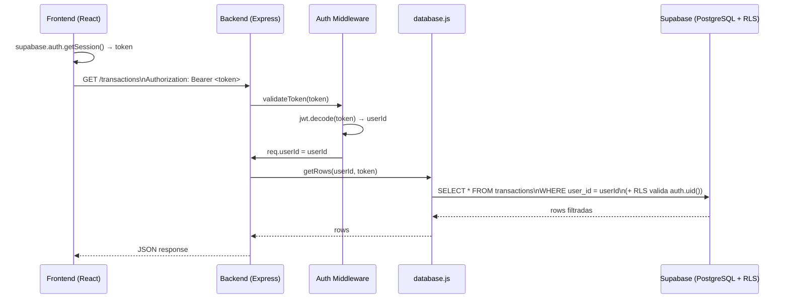
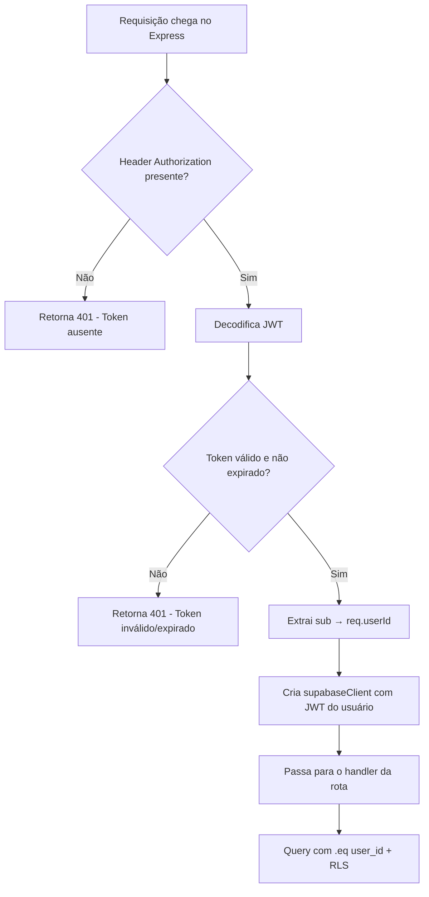

# Design Document — Multi-Tenant (Fase 1: Isolamento por Usuário)

## Overview

Esta feature transforma o Finanças Pro em um sistema multi-tenant adicionando isolamento de dados por usuário. A abordagem usa duas camadas de segurança complementares:

1. **RLS no Supabase** — o banco rejeita automaticamente acessos não autorizados a nível de linha
2. **Auth Middleware no backend** — o Express valida o JWT e filtra todas as queries pelo `user_id`

O frontend passa a enviar o JWT do Supabase em cada requisição HTTP. O backend valida esse token, extrai o `user_id` e o usa em todas as operações de banco. Nenhuma alteração na experiência do usuário é necessária.

### Decisões de Design

- **Dupla camada de segurança**: RLS + filtro no backend. O RLS é a última linha de defesa; o filtro no backend é a primeira. Isso garante que mesmo um bug no middleware não exponha dados de outros usuários.
- **JWT do Supabase como fonte de verdade**: O backend não mantém sessão própria. O `user_id` vem sempre do JWT emitido pelo Supabase Auth.
- **Cliente Supabase com JWT do usuário**: Para que o RLS funcione, o cliente Supabase no backend precisa ser instanciado com o JWT do usuário (não com a ANON_KEY global). Isso é feito criando um cliente por requisição usando `createClient` com o token do header.
- **Migração não-destrutiva**: Dados legados são associados ao primeiro usuário cadastrado, preservando o histórico.

---

## Architecture



### Fluxo de Autenticação



---

## Components and Interfaces

### 1. Auth Middleware (`server/authMiddleware.js`)

Novo arquivo. Responsável por validar o JWT e popular `req.userId` e `req.supabase`.

```js
// Interface
function authMiddleware(req, res, next)
// req.userId  → string (UUID do usuário)
// req.supabase → SupabaseClient instanciado com o JWT do usuário
```

O middleware decodifica o JWT usando `jsonwebtoken` com a chave `SUPABASE_JWT_SECRET` (disponível no painel do Supabase em Settings > API > JWT Secret).

Para criar o cliente Supabase com o JWT do usuário, usa `createClient` com `global.headers.Authorization`:

```js
const userSupabase = createClient(SUPABASE_URL, SUPABASE_ANON_KEY, {
  global: { headers: { Authorization: `Bearer ${token}` } }
});
```

Isso faz com que todas as queries desse cliente respeitem o RLS com `auth.uid()` do usuário.

### 2. database.js — Assinatura das funções

Todas as funções de acesso ao banco passam a receber `supabase` (cliente com JWT do usuário) e `userId` como parâmetros:

```js
// Antes
async function getRows()
async function saveTransactionsToDb(transactions)

// Depois
async function getRows(supabase, userId)
async function saveTransactionsToDb(supabase, userId, transactions)
async function updateTransactionInDb(supabase, userId, id, t)
async function deleteTransactionFromDb(supabase, userId, id)
async function getSuppliers(supabase, userId)
async function addSupplier(supabase, userId, nome, categoria)
async function updateSupplier(supabase, userId, id, nome, categoria)
async function deleteSupplierFromDb(supabase, userId, id)
async function getSettings(supabase, userId)
async function getSetting(supabase, userId, key)
async function updateSetting(supabase, userId, key, value)
async function getBankProfiles(supabase, userId)
async function addBankProfile(supabase, userId, nome, identificador, palavras_ignorar, cartao_final)
async function updateBankProfile(supabase, userId, id, nome, identificador, palavras_ignorar, cartao_final)
async function deleteBankProfile(supabase, userId, id)
```

### 3. Frontend — axios com interceptor

Em `client/src/App.jsx`, adicionar um interceptor axios que injeta o token em todas as requisições:

```js
// Interceptor global (configurado uma vez no useEffect inicial)
axios.interceptors.request.use(async (config) => {
  const { data: { session } } = await supabase.auth.getSession();
  if (session?.access_token) {
    config.headers.Authorization = `Bearer ${session.access_token}`;
  }
  return config;
});
```

### 4. Rotas protegidas vs. públicas

| Rota | Protegida? |
|------|-----------|
| `GET /` | Não |
| `GET /health` | Não |
| `GET /whatsapp-status` | Não |
| `GET /whatsapp-qr` | Não |
| `GET /whatsapp-start` | Não |
| `POST /whatsapp-logout` | Não |
| `GET /transactions` | **Sim** |
| `POST /save-transactions` | **Sim** |
| `PUT /transactions/:id` | **Sim** |
| `DELETE /transactions/:id` | **Sim** |
| `GET /dashboard-stats` | **Sim** |
| `GET /suppliers` | **Sim** |
| `POST /suppliers` | **Sim** |
| `PUT /suppliers/:id` | **Sim** |
| `DELETE /suppliers/:id` | **Sim** |
| `GET /settings` | **Sim** |
| `POST /settings` | **Sim** |
| `GET /bank-profiles` | **Sim** |
| `POST /bank-profiles` | **Sim** |
| `PUT /bank-profiles/:id` | **Sim** |
| `DELETE /bank-profiles/:id` | **Sim** |
| `POST /process-image` | **Sim** |

---

## Data Models

### Alterações nas tabelas (SQL)

```sql
-- Adicionar user_id em cada tabela (idempotente com IF NOT EXISTS)
ALTER TABLE transactions   ADD COLUMN IF NOT EXISTS user_id uuid REFERENCES auth.users(id);
ALTER TABLE suppliers      ADD COLUMN IF NOT EXISTS user_id uuid REFERENCES auth.users(id);
ALTER TABLE bank_profiles  ADD COLUMN IF NOT EXISTS user_id uuid REFERENCES auth.users(id);
ALTER TABLE settings       ADD COLUMN IF NOT EXISTS user_id uuid REFERENCES auth.users(id);
```

### Script de migração de dados legados

```sql
-- migration.sql
DO $$
DECLARE
  first_user_id uuid;
BEGIN
  SELECT id INTO first_user_id FROM auth.users ORDER BY created_at ASC LIMIT 1;

  IF first_user_id IS NULL THEN
    RAISE NOTICE 'Nenhum usuário encontrado. Migração não executada.';
    RETURN;
  END IF;

  UPDATE transactions  SET user_id = first_user_id WHERE user_id IS NULL;
  UPDATE suppliers     SET user_id = first_user_id WHERE user_id IS NULL;
  UPDATE bank_profiles SET user_id = first_user_id WHERE user_id IS NULL;
  UPDATE settings      SET user_id = first_user_id WHERE user_id IS NULL;

  RAISE NOTICE 'Migração concluída para user_id: %', first_user_id;
END $$;

-- Após migração, tornar NOT NULL
ALTER TABLE transactions   ALTER COLUMN user_id SET NOT NULL, ALTER COLUMN user_id SET DEFAULT auth.uid();
ALTER TABLE suppliers      ALTER COLUMN user_id SET NOT NULL, ALTER COLUMN user_id SET DEFAULT auth.uid();
ALTER TABLE bank_profiles  ALTER COLUMN user_id SET NOT NULL, ALTER COLUMN user_id SET DEFAULT auth.uid();
ALTER TABLE settings       ALTER COLUMN user_id SET NOT NULL, ALTER COLUMN user_id SET DEFAULT auth.uid();
```

### Configuração de RLS

```sql
-- Habilitar RLS
ALTER TABLE transactions   ENABLE ROW LEVEL SECURITY;
ALTER TABLE suppliers      ENABLE ROW LEVEL SECURITY;
ALTER TABLE bank_profiles  ENABLE ROW LEVEL SECURITY;
ALTER TABLE settings       ENABLE ROW LEVEL SECURITY;

-- Políticas para transactions
CREATE POLICY "transactions_select" ON transactions FOR SELECT USING (user_id = auth.uid());
CREATE POLICY "transactions_insert" ON transactions FOR INSERT WITH CHECK (user_id = auth.uid());
CREATE POLICY "transactions_update" ON transactions FOR UPDATE USING (user_id = auth.uid());
CREATE POLICY "transactions_delete" ON transactions FOR DELETE USING (user_id = auth.uid());

-- (repetir para suppliers, bank_profiles, settings)
```

### Variável de ambiente adicional

```
SUPABASE_JWT_SECRET=<valor do painel Supabase → Settings → API → JWT Secret>
```

---

## Correctness Properties

*A property is a characteristic or behavior that should hold true across all valid executions of a system — essentially, a formal statement about what the system should do. Properties serve as the bridge between human-readable specifications and machine-verifiable correctness guarantees.*

### Property 1: Isolamento de leitura por usuário

*For any* dois usuários distintos A e B, registros inseridos pelo usuário A não devem aparecer nos resultados de queries executadas no contexto do usuário B (e vice-versa), em nenhuma das tabelas (`transactions`, `suppliers`, `bank_profiles`, `settings`).

**Validates: Requirements 2.2, 5.1**

---

### Property 2: user_id preservado no INSERT

*For any* registro inserido via backend com um `userId` válido, ao consultar esse registro no banco, o campo `user_id` deve ser igual ao `userId` usado na inserção.

**Validates: Requirements 5.2**

---

### Property 3: Isolamento de escrita (UPDATE e DELETE)

*For any* usuário A tentando atualizar ou excluir um registro cujo `user_id` pertence ao usuário B, a operação deve falhar silenciosamente (retornar 0 linhas afetadas ou 404), sem modificar o registro original.

**Validates: Requirements 5.3, 5.4, 5.5**

---

### Property 4: Middleware rejeita tokens inválidos

*For any* string que não seja um JWT válido e não-expirado assinado pelo Supabase (incluindo tokens malformados, expirados, com assinatura incorreta ou ausentes), o Auth Middleware deve retornar HTTP 401.

**Validates: Requirements 4.1, 4.3, 4.4**

---

### Property 5: Extração correta do user_id

*For any* JWT válido emitido pelo Supabase, o `user_id` extraído pelo middleware deve ser igual ao campo `sub` do payload decodificado.

**Validates: Requirements 4.2**

---

### Property 6: Frontend sempre envia token em rotas protegidas

*For any* chamada axios feita pelo frontend quando o usuário está autenticado, o header `Authorization: Bearer <token>` deve estar presente e conter o token da sessão atual do Supabase.

**Validates: Requirements 3.1, 3.2**

---

### Property 7: Idempotência do script de migração

*For any* banco de dados onde o script de migração já foi executado, executá-lo novamente não deve gerar erros nem alterar os dados existentes.

**Validates: Requirements 1.4**

---

## Error Handling

| Cenário | Comportamento esperado |
|---------|----------------------|
| Header `Authorization` ausente | 401 `{ error: "Token de autenticação ausente" }` |
| Token malformado | 401 `{ error: "Token inválido" }` |
| Token expirado | 401 `{ error: "Token expirado. Faça login novamente." }` |
| `SUPABASE_JWT_SECRET` não configurado | 500 no boot, log de erro crítico |
| Usuário tenta acessar recurso de outro usuário | 404 (não revela existência) |
| RLS rejeita query (sem JWT no cliente Supabase) | 403 do Supabase → propagado como 500 com log |
| Banco vazio na migração (sem usuários) | NOTICE no SQL, nenhuma atualização executada |

### Estratégia de fallback para WhatsApp

As rotas do WhatsApp (`/whatsapp-*`) não são protegidas pelo Auth Middleware pois o serviço de WhatsApp opera de forma autônoma (recebe mensagens externas). O isolamento de dados para transações criadas via WhatsApp deve ser tratado na Fase 2, quando cada número de WhatsApp será associado a um `user_id`.

---

## Testing Strategy

### Abordagem dual

- **Testes unitários**: verificam exemplos específicos, casos de borda e condições de erro
- **Testes de propriedade**: verificam propriedades universais com entradas geradas aleatoriamente

Ambos são complementares e necessários para cobertura completa.

### Testes unitários (exemplos e casos de borda)

- Verificar que as 4 tabelas possuem a coluna `user_id` após migração (Req 1.1)
- Verificar que `user_id` é NOT NULL após migração (Req 1.2)
- Verificar que dados legados foram associados ao primeiro usuário (Req 1.3)
- Verificar que RLS está habilitado nas 4 tabelas (Req 2.1)
- Verificar que existem políticas para SELECT/INSERT/UPDATE/DELETE em cada tabela (Req 2.4)
- Verificar que rotas protegidas retornam 401 sem token (Req 4.5)
- Verificar que rotas de saúde respondem sem token (Req 4.6)
- Verificar que usuário não autenticado não dispara chamadas ao backend (Req 3.3)
- Verificar que script de migração em banco vazio não gera erro (Req 6.3)

### Testes de propriedade (property-based)

Biblioteca recomendada: **fast-check** (Node.js/JavaScript)

Cada teste deve rodar no mínimo **100 iterações**.

```
// Tag format: Feature: multi-tenant, Property N: <descrição>
```

**Property 1 — Isolamento de leitura**
```
// Feature: multi-tenant, Property 1: Isolamento de leitura por usuário
// Para qualquer par de userIds distintos, registros de um não aparecem nas queries do outro
```
Gerar: dois UUIDs aleatórios, inserir N registros para cada um, consultar com cada userId e verificar que os conjuntos são disjuntos.

**Property 2 — user_id preservado no INSERT**
```
// Feature: multi-tenant, Property 2: user_id preservado no INSERT
// Para qualquer userId e dados de registro, o user_id salvo deve ser igual ao userId da requisição
```
Gerar: UUID aleatório + dados de transação aleatórios, inserir, consultar e verificar `user_id`.

**Property 3 — Isolamento de escrita**
```
// Feature: multi-tenant, Property 3: Isolamento de escrita (UPDATE e DELETE)
// Para qualquer par de usuários, um não consegue modificar registros do outro
```
Gerar: dois usuários, registros para o usuário A, tentar UPDATE/DELETE com userId do usuário B, verificar que o registro permanece inalterado.

**Property 4 — Middleware rejeita tokens inválidos**
```
// Feature: multi-tenant, Property 4: Middleware rejeita tokens inválidos
// Para qualquer string que não seja um JWT válido, o middleware retorna 401
```
Gerar: strings aleatórias, tokens com assinatura incorreta, tokens expirados. Verificar que todos retornam 401.

**Property 5 — Extração correta do user_id**
```
// Feature: multi-tenant, Property 5: Extração correta do user_id
// Para qualquer JWT válido, o user_id extraído é igual ao campo sub do payload
```
Gerar: UUIDs aleatórios, criar JWTs válidos com esses UUIDs como `sub`, verificar que o middleware extrai o mesmo UUID.

**Property 6 — Frontend envia token**
```
// Feature: multi-tenant, Property 6: Frontend sempre envia token em rotas protegidas
// Para qualquer chamada axios com sessão ativa, o header Authorization está presente
```
Mockar `supabase.auth.getSession()` com tokens aleatórios, interceptar chamadas axios e verificar presença do header.

**Property 7 — Idempotência da migração**
```
// Feature: multi-tenant, Property 7: Idempotência do script de migração
// Executar a migração N vezes produz o mesmo resultado que executar uma vez
```
Executar o script de migração duas vezes e verificar que o estado final é idêntico e sem erros.
