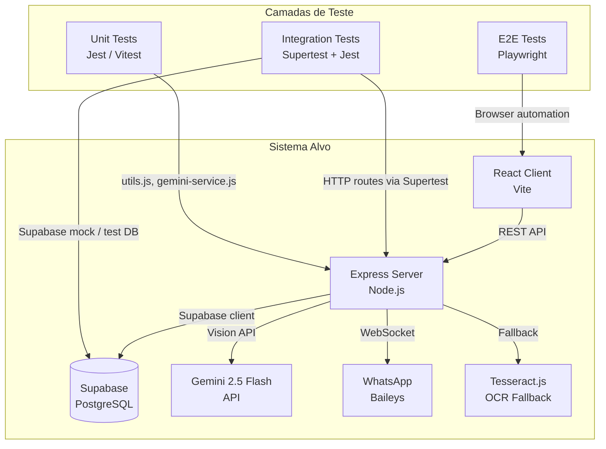
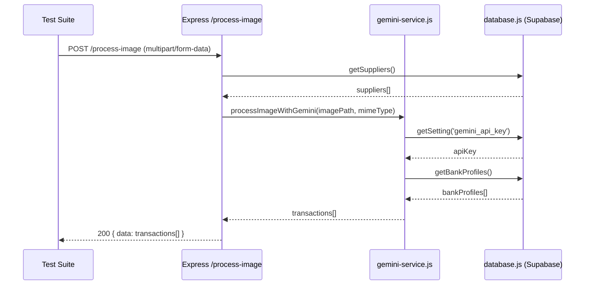
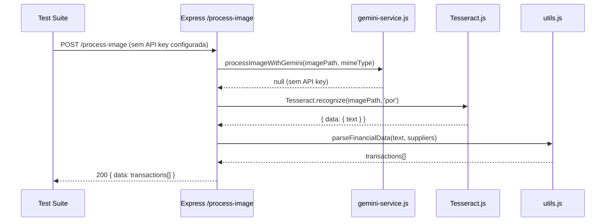

# Design Document: System Testing

## Overview

Este documento define a estratégia e arquitetura de testes para o Finan-as-Pro, uma aplicação financeira composta por um servidor Node.js/Express com banco de dados Supabase (PostgreSQL), um cliente React/Vite, integração com WhatsApp via Baileys e processamento de imagens via Google Gemini 2.5 Flash (com fallback Tesseract.js).

O objetivo é criar uma suíte de testes abrangente que cubra as camadas de unidade, integração e end-to-end, garantindo a confiabilidade dos fluxos críticos: extração de transações via OCR/IA, persistência no banco de dados, automação via WhatsApp e operações CRUD do dashboard.

## Architecture



## Sequence Diagrams

### Fluxo de Processamento de Imagem (Caminho Feliz)



### Fluxo de Processamento de Imagem (Fallback Tesseract)



### Fluxo WhatsApp - Mensagem de Texto

```mermaid
sequenceDiagram
    participant Test as Test Suite
    participant WA as whatsapp-service.js
    participant DB as database.js
    participant Sock as Baileys S